# Divergence
*A sci-fi rogue-lite survival game*

## Overview
Divergence is a 2D top-down rogue-lite survival game developed as part of a 4-month educational project. The game focuses on fast-paced gameplay, enemy waves, experience collection, and ability progression within a single run.

## Features
- Top-down 2D gameplay focused on survival and progression
- Enemy waves with multiple enemy types
- Ability system with upgradable skills
- Optimized map loading using a chunk-based system
- Custom save files
- Stackable status effects system (temporary buffs/debuffs e.g., poison that deals DOT, haste that increases speed)
- Stats system (modifiers, stats affecting other stats)

## Technologies Used
- **Unity Editor Version:** 6000.2.6f2
- **Engine:** Unity
- **Version Control:** Git, Unity Version Control

## Installation & Development Setup
1. Clone the repository using Git.
2. Open the project using **Unity Editor 6000.2.6f2** or later.
3. Allow Unity to import all assets.
4. Run the project from the main scene.

## Screenshots
#### MainMenu
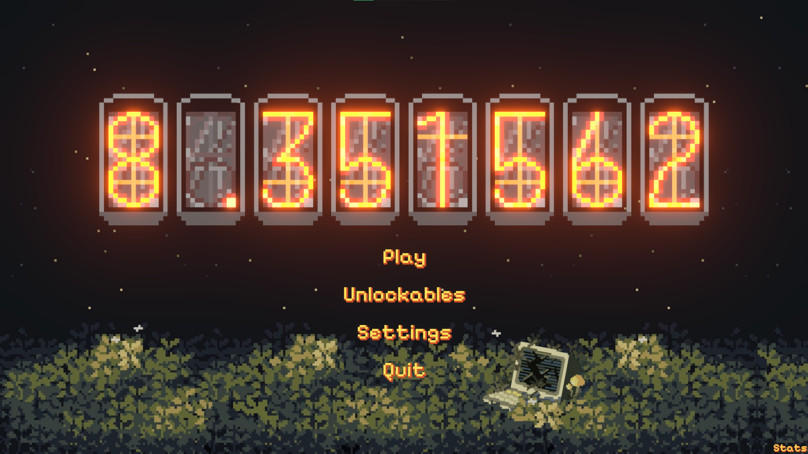
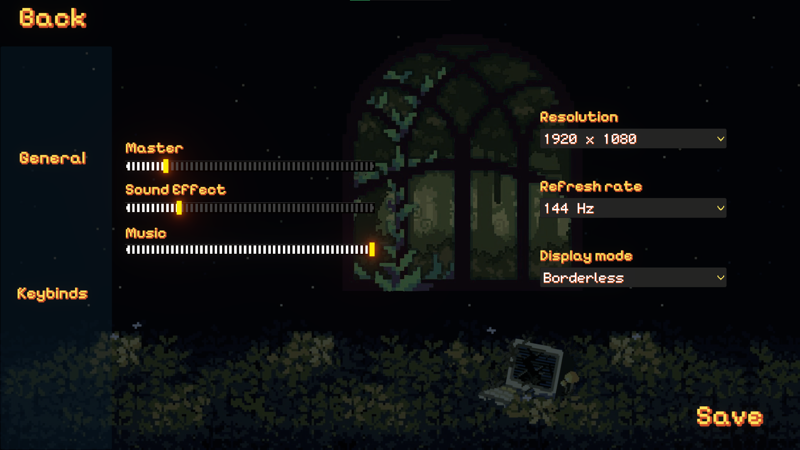
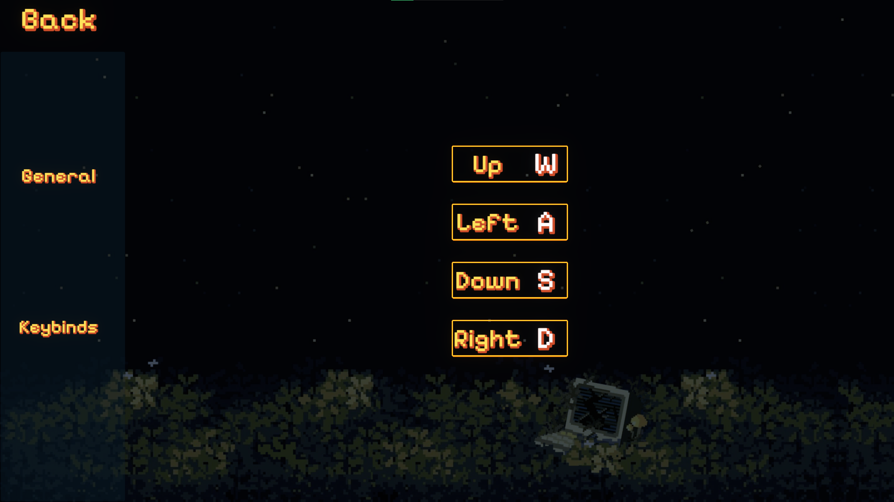
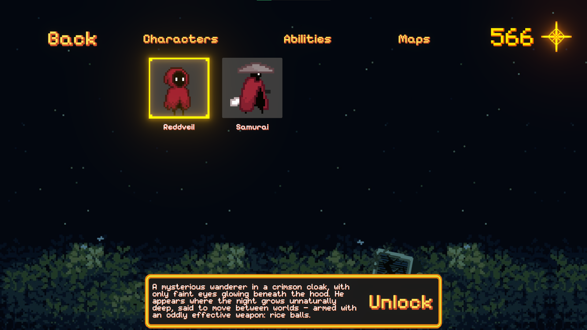
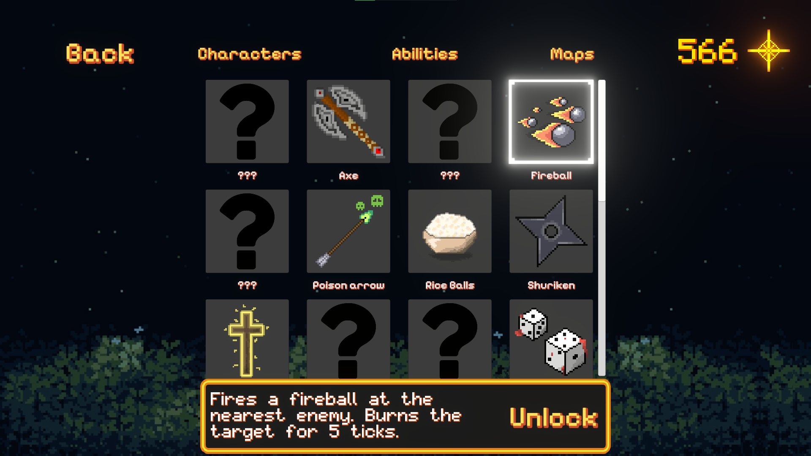
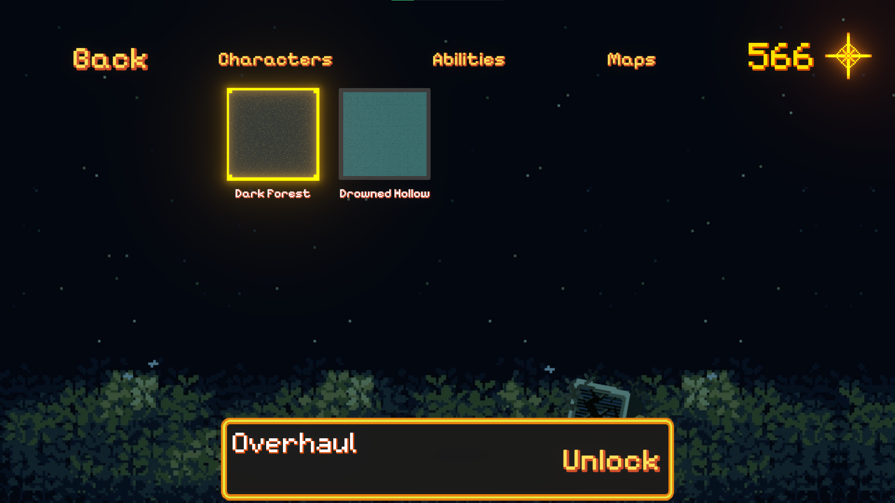
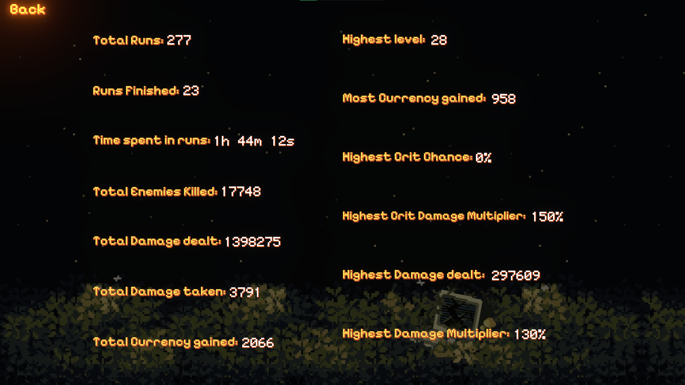

#### Game
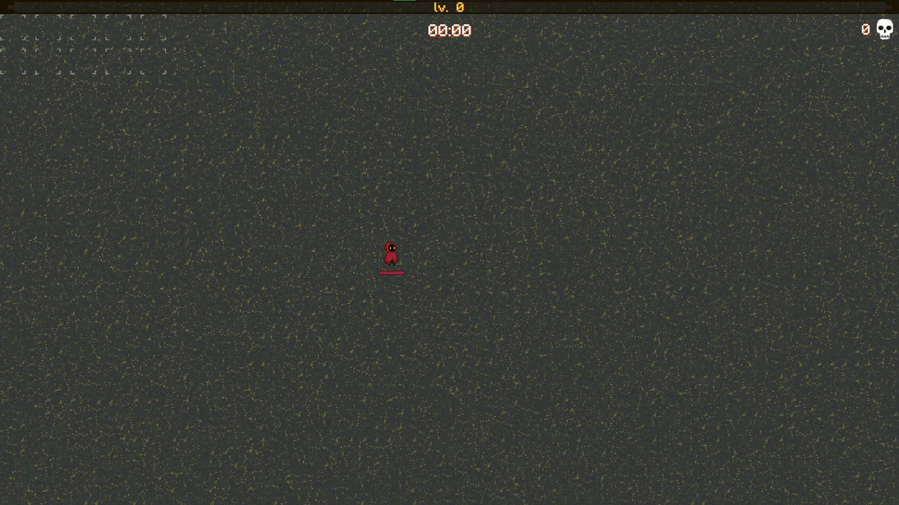
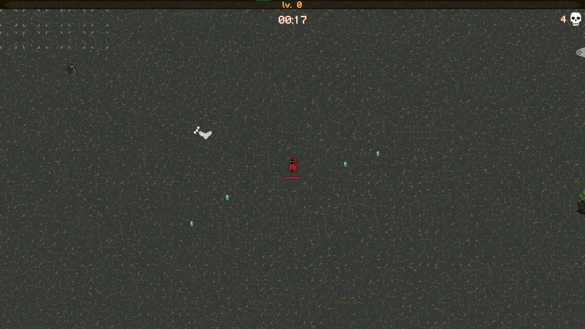
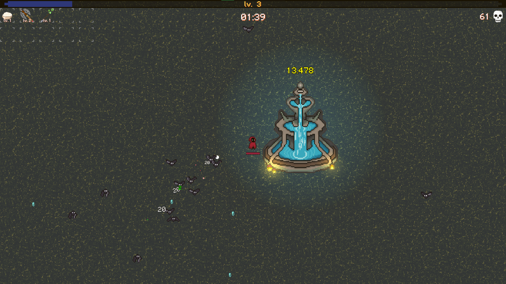
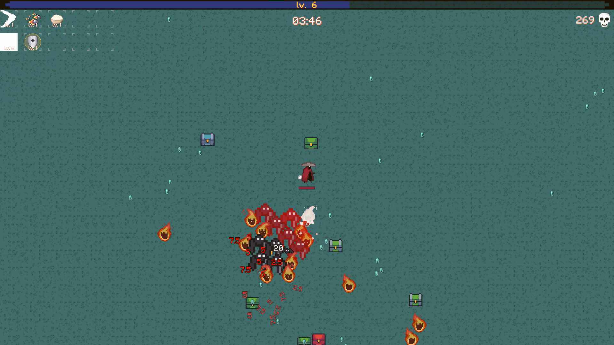
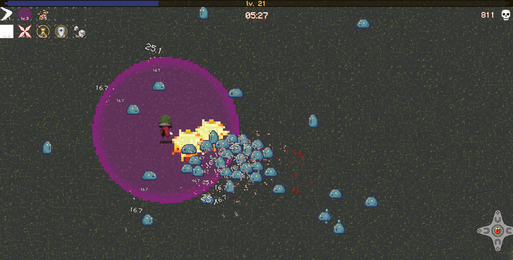

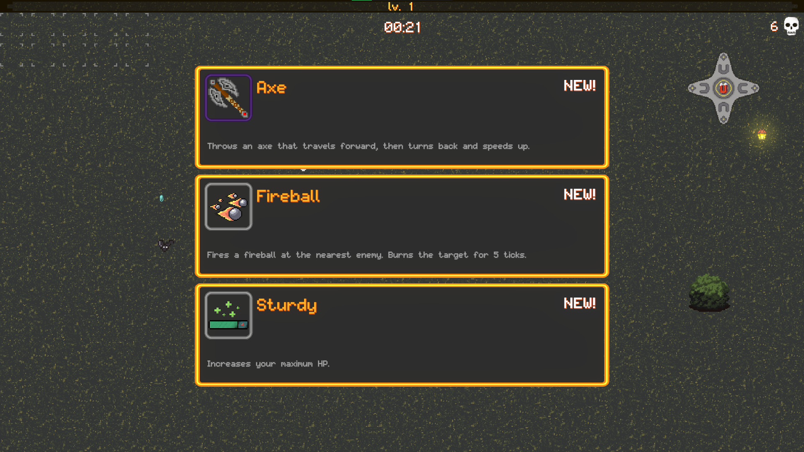
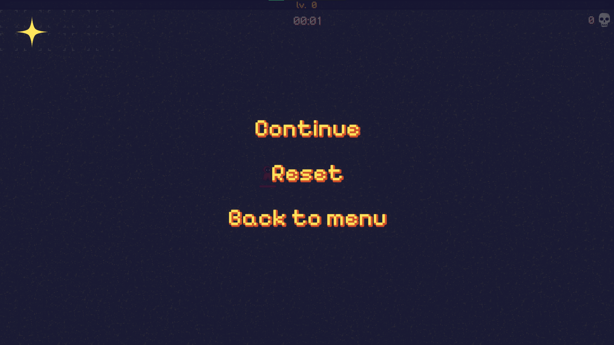
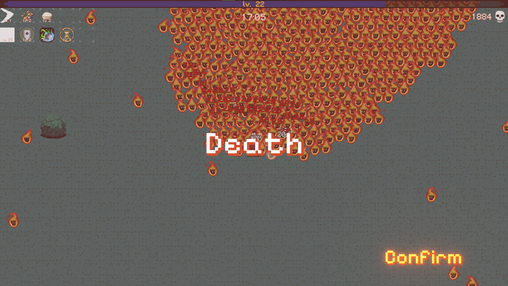
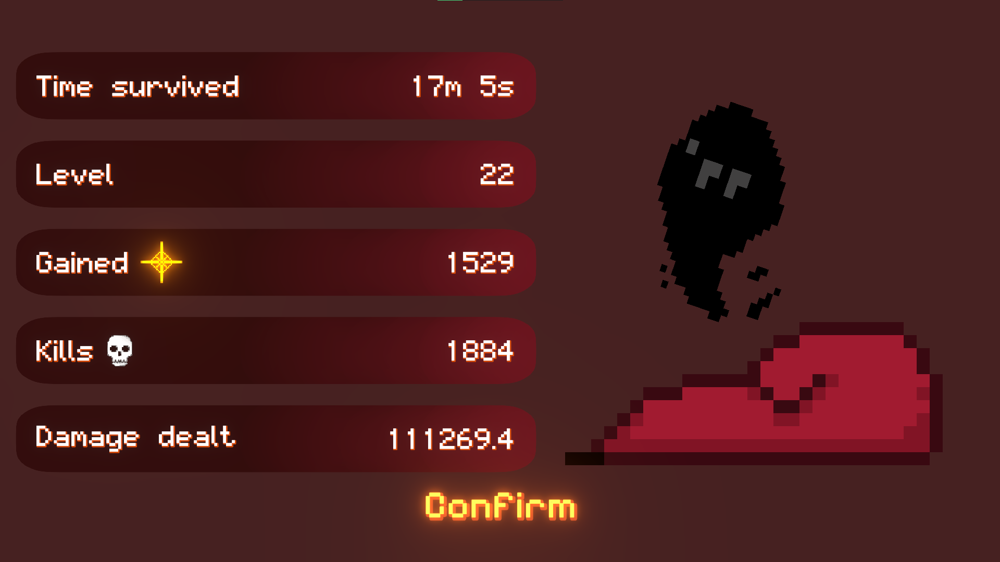

## License
This project is distributed under the **MIT License**.  
See the LICENSE file for details.
